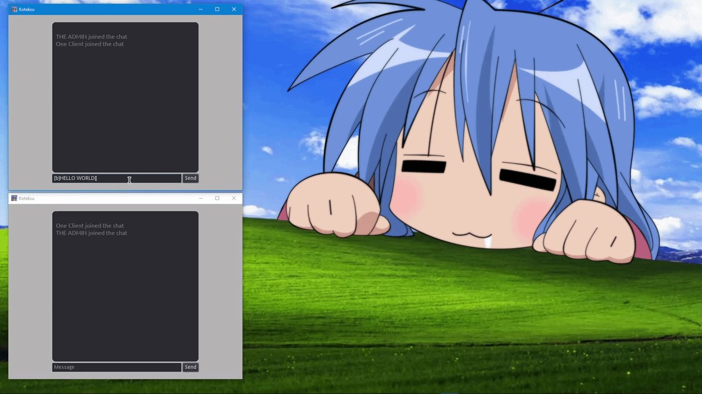
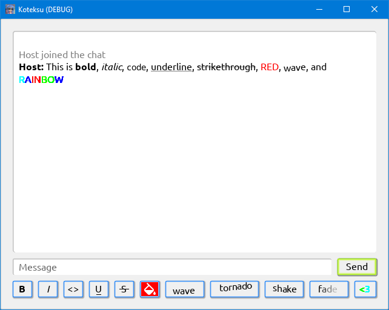
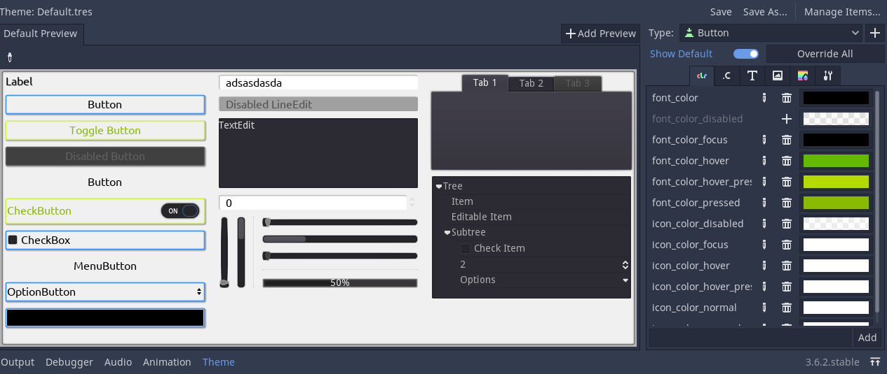

     
    Basic RPC chat with BBCode support via Godot!

<h1>Koteksu</h1>

I wonder what a random chatbox Konata would make on her free time? Mayhaps this kind of thing.

## Features
- BBCode styles: https://docs.godotengine.org/en/3.6/tutorials/ui/bbcode_in_richtextlabel.html
- Upon press, BBCode now automatically wraps around and applies to the selected text!
- Responsive UI
- Custom themes (see [Theme](#theme))

    

## Theme
The Main node now uses the `Default.tres` Theme Resource by default. It is then used by its children nodes.

## Usage
1. To test, export a build first.
2. Have 2 instances of build.
3. Input a username and local address for the host, then press `Host` button.
4. Once the host is done, input the same address but choose `Join` this time.
5. Enjoy testing!

## TO-DO
- [x] BBCode style upon press
- [x] Custom themes
- [ ] GIF API and integration

## Credits
- Konata Izumi edit, Pin: https://www.pinterest.com/pin/konata-and-co--9288742975346064/
- Uses [Ubuntu](https://fonts.google.com/specimen/Ubuntu) and [Noto Sans Mono](https://fonts.google.com/noto/specimen/Noto+Sans+Mono) fonts
- Icons8 *Fill Color* icon: https://icons8.com/icons/set/fill-color--os-android

## License
- Ubuntu is under its [Ubuntu Font License](Resources/Font/Ubuntu/UFL.txt) while Noto Sans Mono on [SIL Open Font License](Resources/Font/Noto_Sans_Mono/OFL.txt).