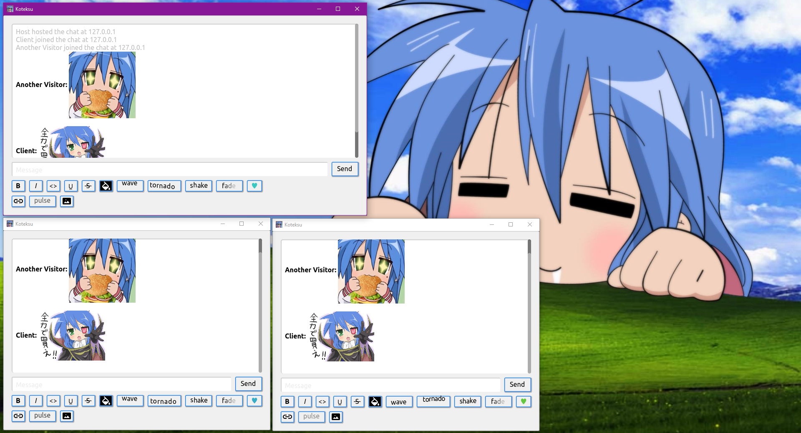
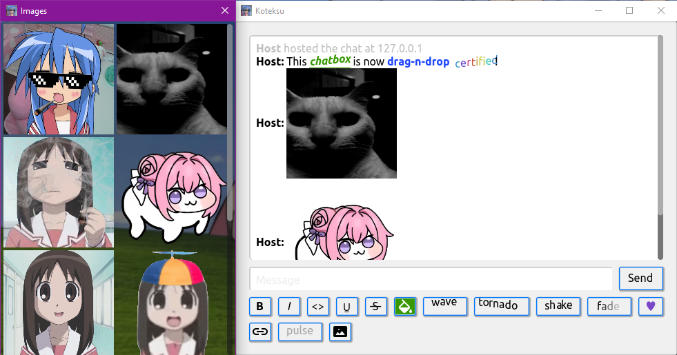
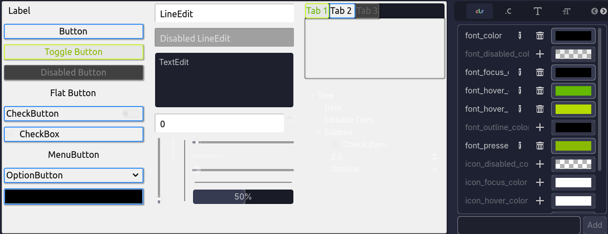

     
    A simple richtext chat board made with Godot.

<h1>Koteksu</h1>

I wonder what a random chatbox Konata would make on her free time? Mayhaps this kind of thing.

https://github.com/user-attachments/assets/1db4a07d-ef0d-4d79-aa9a-09827e810cba

    

    

## Usage
1. To test export a build first.
2. Have 2 or more instances of build.
3. Input a username and local address for the host, then press `Host` button.
4. Once the host is done, input the same address but choose `Join` this time.
5. Enjoy testing!

## Features
- BBCode support: `bold` `italic` `code` `underline` `strikethrough` `color` `wave` `tornado` `shake` `fade` `rainbow` `url` `pulse`
    - For more info: https://docs.godotengine.org/en/latest/tutorials/ui/bbcode_in_richtextlabel.html
- Images
- Now on Godot 4.x! For Godot 3.6 visit [this branch](https://github.com/UbeJelly/Koteksu/tree/Godot_3.6)
    - More features for RichTextLabel's BBCode, subwindows, etc.
- Upon press, BBCode now automatically wraps around and applies to the selected text!
- Responsive UI
- Custom themes (see [Theme](#theme))

## Theme
The Main node now uses the `Default.tres` Theme Resource by default. It is then used by its children nodes.

## TO-DO
- [x] Image support
- [ ] GIF API and integration
- [x] Godot 4 migration
- [x] BBCode style upon press
- [x] Custom themes

## Credits
- Konata Izumi edit, Pin: https://www.pinterest.com/pin/konata-and-co--9288742975346064/
- Uses [Ubuntu](https://fonts.google.com/specimen/Ubuntu) and [Noto Sans Mono](https://fonts.google.com/noto/specimen/Noto+Sans+Mono) fonts
- Icons8 *Fill Color* icon: https://icons8.com/icons/set/fill-color--os-android

## License
- This project is under [MIT License](LICENSE.md) and its contents unless stated otherwise.
- Ubuntu is under its [Ubuntu Font License](Resources/Font/Ubuntu/UFL.txt) while Noto Sans Mono on [SIL Open Font License](Resources/Font/Noto_Sans_Mono/OFL.txt).